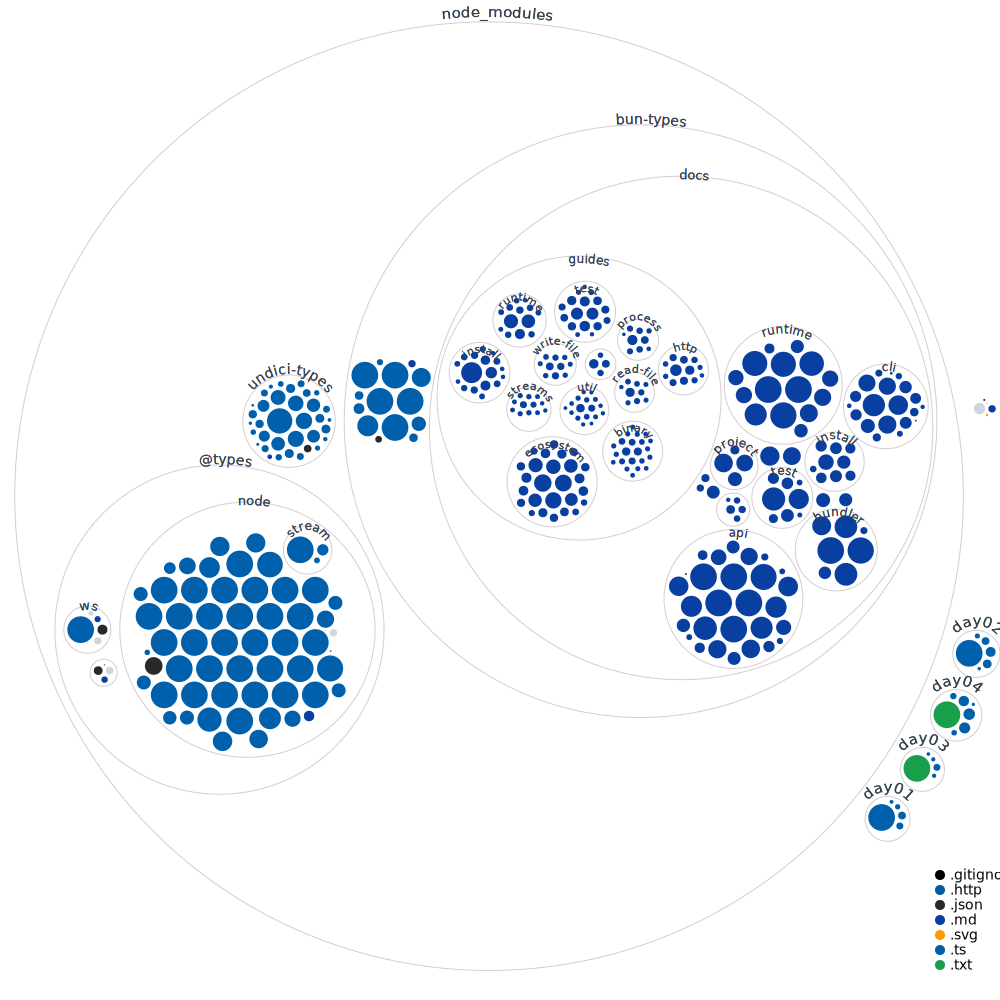

# 🎄 Advent of Code Solutions

My solutions for [Advent of Code](https://adventofcode.com/) challenges.

## Structure

```
├── 2024/
│   ├── day01/
│   │   ├── data.ts
│   │   ├── input.txt
│   │   ├── part01.ts
│   │   ├── part01.test.ts
│   │   └── part02.ts
│   │   └── part02.test.ts
│   ├── day02/
│   └── ...
└── README.md
```

## Running Solutions

```bash
# Run part 1 of a specific day
bun day01/part01.ts

# Run part 2 of a specific day
bun day01/part02.ts
```

## Progress Tracking

### 2024

- [x] Day 1
- [x] Day 2
- [x] Day 3
- [ ] Day 4
- [ ] Day 5
- [ ] Day 6
- [ ] Day 7
- [ ] Day 8
- [ ] Day 9
- [ ] Day 10
- [ ] Day 11
- [ ] Day 12
- [ ] Day 13
- [ ] Day 14
- [ ] Day 15
- [ ] Day 16
- [ ] Day 17
- [ ] Day 18
- [ ] Day 19
- [ ] Day 20
- [ ] Day 21
- [ ] Day 22
- [ ] Day 23
- [ ] Day 24
- [ ] Day 25

## Notes

- Solutions are my own work
- Input files are not included in the repository per AOC's [request](https://www.reddit.com/r/adventofcode/wiki/faqs/copyright/inputs/)

---


